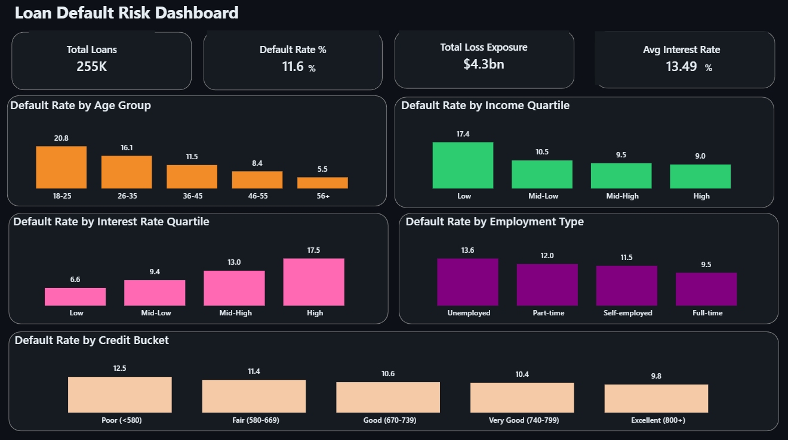

# 💳 Loan Default Risk Analysis — A Business Case Study

An end-to-end data analysis project that identifies which borrower characteristics
predict loan default, and translates those findings into concrete lending-policy
recommendations for a financial institution's credit team.

---

## 📌 Business Problem

A lending institution is losing money to loan defaults but doesn't have a clear,
data-backed view of **which borrower segments carry the highest risk**. This
analysis uses a portfolio of 255,000+ historical loans to answer three questions:

1. Which borrower and loan characteristics are most strongly associated with default?
2. Which segments of the current loan book carry disproportionate risk?
3. What specific changes to approval policy or pricing would reduce future losses?

---

## 🗂️ Dataset

- **Source:** `Loan_default.csv`
- **Size:** 255,347 loan records, 18 features, no missing values
- **Fields:** Age, Income, Loan Amount, Credit Score, Months Employed, Number of
  Credit Lines, Interest Rate, Loan Term, DTI Ratio, Education, Employment Type,
  Marital Status, Has Mortgage, Has Dependents, Loan Purpose, Has Co-Signer, Default (target)

---

## 🛠️ Tools & Technologies

| Category              | Tools                                       |
| ---------------------- | -------------------------------------------- |
| Data Cleaning & EDA     | Python (Pandas, Matplotlib, Seaborn)         |
| Querying                | SQL (window functions, CASE segmentation)    |
| Visualization           | Power BI                                     |
| Notebook                 | Jupyter / Python script                     |

---

## 🎯 Approach

1. **Data cleaning & validation** — checked for missing values and out-of-range figures (dataset was already clean; validated ranges for age, income, credit score, DTI).
2. **Segmentation** — bucketed continuous variables (age, income, credit score, interest rate, DTI ratio) into business-readable bands.
3. **Exploratory analysis** — measured default rate across each segment and visualized the differences.
4. **Correlation analysis** — quantified which numeric features move most strongly with default risk.
5. **SQL analysis** — replicated key findings in SQL using window functions and CASE-based segmentation, and quantified dollar exposure at risk.
6. **Power BI dashboard** — built an interactive view for the credit team to filter risk by segment.
7. **Business recommendations** — translated statistical findings into specific, actionable lending-policy suggestions.

---

## 🔍 Key Findings

| Factor | Finding |
|---|---|
| **Age** | Default rate falls sharply with age: **20.8%** for borrowers 18–25 vs. **5.5%** for borrowers 56+. Age was the single strongest predictor (correlation: -0.17). |
| **Interest Rate** | Borrowers in the highest interest-rate quartile default at **17.5%**, nearly 3x the rate of the lowest quartile (**6.6%**) — current risk-based pricing is at least partially reflecting real risk. |
| **Income** | The lowest income quartile defaults at **17.4%**, almost double the highest quartile (**9.0%**). |
| **Credit Score** | Surprisingly weak signal on its own — default rate only drops from **12.5%** (Poor) to **9.8%** (Excellent), suggesting credit score alone is an incomplete risk indicator in this portfolio. |
| **Co-Signer** | Loans with a co-signer default at **10.4%** vs. **12.9%** without one. |
| **Employment Type** | Unemployed borrowers default at **13.6%**, vs. **9.5%** for full-time employed borrowers. |
| **Loan Purpose** | Business loans are the riskiest category (**12.3%** default rate); Home loans are the safest (**10.2%**). |
| **Loss Exposure** | Defaulted loans have a higher average loan amount (**$144,515**) than repaid loans (**$125,354**) — meaning risk is concentrated in larger, more costly loans. |

---

## 💡 Business Recommendations

1. **Introduce age and employment-tenure as explicit factors in the credit approval model.** Borrowers under 26 default at nearly 4x the rate of borrowers over 55 — a flat approval policy across age groups is mispricing risk.

2. **Require a co-signer or additional income verification for borrowers in the bottom income quartile.** This segment shows a default rate of 17.4%, the highest of any income band, and co-signers are independently associated with a ~2.5 point reduction in default rate.

3. **Re-evaluate reliance on credit score as a primary risk filter.** Credit score shows a weaker relationship with default than income or age in this portfolio — a combined score (income + age + employment type) would likely be a better approval criterion than credit score alone.

4. **Apply tighter underwriting to Business-purpose loans**, which carry both the highest default rate (12.3%) and, combined with generally larger loan sizes, the highest dollar loss exposure — consider caps on loan-to-income ratio for this category specifically.

5. **Monitor interest-rate-tier performance regularly.** Since the highest interest-rate quartile already shows a much higher default rate, the institution should verify that rates are being priced correctly for risk, and are not themselves contributing to defaults by increasing repayment burden for already-risky borrowers.

---

## 📊 Visualizations

**Power BI Dashboard** — interactive view with 4 KPI cards (Total Loans, Default Rate, Total Loss Exposure, Avg Interest Rate) and 5 default-rate breakdown charts (Age Group, Income Quartile, Interest Rate Quartile, Employment Type, Credit Score Band).



**Python EDA Charts** (in `charts/` folder):
1. Default Rate by Age Group
2. Default Rate by Income Quartile
3. Default Rate by Interest Rate Quartile
4. Default Rate by Credit Score Band
5. Default Rate by Employment Type
6. Correlation Heatmap (numeric features vs. default)
7. Default Rate: Co-Signer vs. Dependents

---

## 📁 Project Structure

```
loan-default-risk-analysis/
│
├── Loan_default.csv                  # Raw dataset
├── loan_default_eda.py               # Python EDA script (also generates Loan_default_cleaned.csv)
├── loan_default_queries.sql          # SQL analysis queries
├── Loan Default Risk Dashboard.pbix  # Power BI dashboard
├── dashboard_screenshot.png          # Power BI dashboard screenshot
├── charts/                           # Exported chart images
└── README.md
```

> Note: `Loan_default_cleaned.csv` (the feature-engineered dataset used for SQL/Power BI) is not stored in this repo due to file size — it is auto-generated by running `loan_default_eda.py` on the raw dataset.

---

## 🚀 How to Run

1. Clone the repository
   ```
   git clone https://github.com/<your-username>/loan-default-risk-analysis.git
   cd loan-default-risk-analysis
   ```
2. Install dependencies
   ```
   pip install pandas matplotlib seaborn
   ```
3. Run the analysis (also generates `Loan_default_cleaned.csv`)
   ```
   python loan_default_eda.py
   ```
4. Explore SQL queries in `loan_default_queries.sql`
5. Open `Loan Default Risk Dashboard.pbix` in Power BI Desktop for the interactive dashboard

---

## 📁 Dataset Source

[Loan Default Prediction Dataset](https://www.kaggle.com/datasets/nikhil1e9/loan-default) — Kaggle

---

## 👤 Author

**Ajit Pal**
🔗 [LinkedIn](https://www.linkedin.com/in/ajit-pal-2016b33ba)
